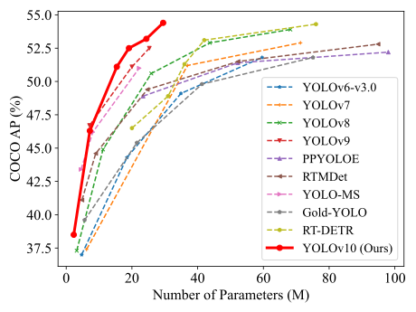

# Enhanced Retail Self-Checkout System based on YOLOv8 and YOLOv10 Networks

This project focuses on innovating the retail self-checkout process using advanced object detection techniques provided by YOLOv8 and YOLOv10 networks. Our implementation enhances the traditional self-checkout experience through improved accuracy and real-time detection capabilities.

## Real-Time Object Detection Performance

<p align="center">
  
   <br>
  Comparisons with other models in terms of latency-accuracy (left) and size-accuracy (right) trade-offs.
</p>

[](https://arxiv.org/abs/2405.14458) <a href="https://colab.research.google.com/github/roboflow-ai/notebooks/blob/main/notebooks/train-yolov10-object-detection-on-custom-dataset.ipynb#scrollTo=SaKTSzSWnG7s"></a>

## Installation and Usage

For detailed installation and usage instructions, please refer to our [installation guide](#installation).

## Updates and Integrations

Stay tuned for the latest updates and integrations regarding the project [here](#updates-🔥).

## Acknowledgement

This project builds upon the work by [YOLOv10 contributors](https://github.com/THU-MIG/yolov10) and others in the community. We express our gratitude for their excellent implementations that made this enhancement possible.

## Citation

If our project or models help your work, please consider citing:

```BibTeX
@article{tan2024enhanced,
  title={Enhanced self-checkout system for retail based on improved yolov10},
  author={Tan, Lianghao and Liu, Shubing and Gao, Jing and Liu, Xiaoyi and Chu, Linyue and Jiang, Huangqi},
  journal={Journal of Imaging},
  volume={10},
  number={10},
  pages={248},
  year={2024},
  publisher={MDPI}
}
```

